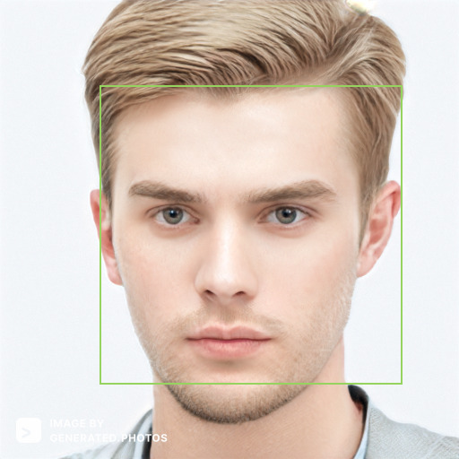
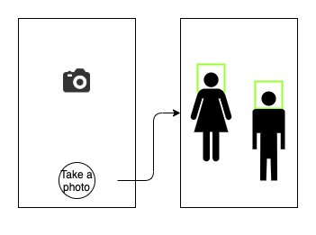

# Coding Challenge

The purpose of this challenge is to understand your coding skills and practices.
**Please treat this repository as your own open source project, as if you were collaborating with other contributors.**

### Goal

Create a camera app that allows the user to take a selfie and show the face detection result.

### Requirements

- Use Kotlin (for Android) or Swift (for iOS).
- Implement the camera selfie feature with official Android or iOS API.
- Use [imagga](https://imagga.com/)'s API - `/faces/detections` result to draw the face locations.
  - Please sign up and get the API key
  - `POST` the selfie photo to `/faces/detections` and it will returns the face locations.
  - Please note the limited API usage (up to 1000 / month) in free plan.
  - Draw a rectagle at the face location as the image below.
- Allow the user to take a **photo** with the front camera as default. (Use the rear camera if no front camera)

There are no restrictions on 3rd party libraries.

### Suggested Layout

The specifications are intentionally vague to allow creative leeway on the UI/layout implementation but we suggest having at least two screens:

1. A camera view screen
2. A face detection result screen

### Points of evaluation

- Code that compiles and meets the functional requirements above.
- Architecture - how you’ve structured your code with future maintainability in mind.
- Principles - how you believe code should be written, such as consistent coding style.
- Qualities - how you guarantee your code is functioning.
- Teamwork and communication - how you would work with others through informative GitHub Issues/pull requests/commit messages.
- Consideration for the end-user point of view.

### To submit this challenge

- Submit your work with a Pull Requests to this GitHub repo and assign the reviewer to `japancvdev`.
- Please include a README and describes the steps required for us to compile/run/execute your project.
- Please do not fork this repo.
- If you have any questions, please submit a Github Issue to get in touch with us.

### Statement of Confidentiality

The information contained in these documents is confidential, privileged, and only for the information of the intended recipient and may not be used, published, or redistributed without the prior written consent of Japan Computer Vision KK.
